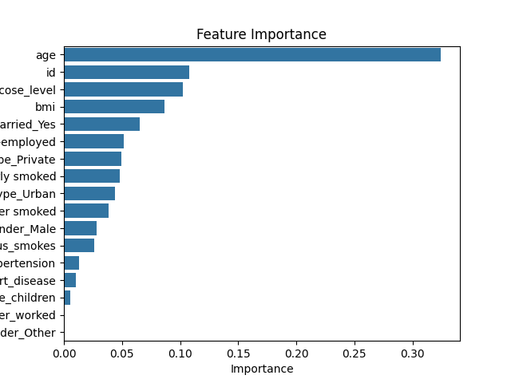
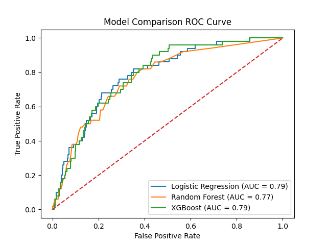
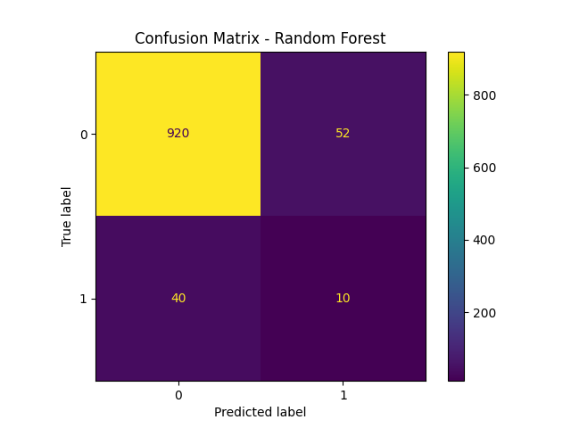

# Stroke Prediction using Machine Learning

## 📌 Project Overview
This project predicts the likelihood of a stroke based on patient health data using Machine Learning techniques.

## 📊 Dataset
- Healthcare Stroke Dataset
- Features include age, BMI, glucose level, hypertension, heart disease, etc.

## ⚙️ Techniques Used
- Data Cleaning & Preprocessing
- Missing Value Handling
- Feature Scaling
- SMOTE (Handling Imbalanced Data)

## 🤖 Machine Learning Models
- Logistic Regression
- Random Forest
- XGBoost

## 📈 Model Evaluation
- Accuracy Score
- ROC-AUC Curve
- Cross Validation

## 🔍 Key Insights
- Age and glucose levels are strong predictors of stroke
- Imbalanced data handling improved model performance significantly

## 📁 Files Included
- `main.py` → Full ML pipeline
- `stroke_prediction_model.pkl` → Trained model
- `scaler.pkl` → Scaler for preprocessing
- `feature_importance.csv` → Feature importance

## 📊Visualizations

#### Correlation Heatmap

#### Feature Importance

#### ROC Curve

#### Confusion Matrix

## 🚀 Future Work
- Deploy model using Streamlit
- Improve model with hyperparameter tuning
- Add UI for real-time predictions

## 👩‍💻 Author
Riya Ghag
