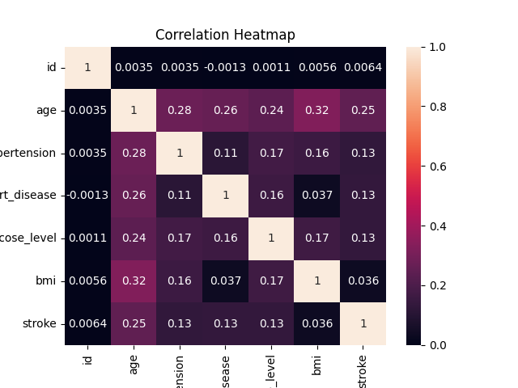

# 🧠 Stroke Risk Prediction (AI + Clinical Logic)

🔗 **Live App:** https://stroke-prediction-ml-project.streamlit.app/
💻 **GitHub:** https://github.com/riyaghag

---

## 📌 Overview

A machine learning–based web app that predicts **stroke risk probability** and presents results with simple clinical interpretation.

The system combines:
* ML model prediction
* Basic rule-based adjustments (age, BMI, smoking, etc.)
* Clear risk categorization

---

## ⚙️ Tech Stack

* Python
* Pandas, NumPy
* Matplotlib
* Streamlit
* Scikit-learn
---

## 💻 Model Summary

* Data cleaned and preprocessed
* Categorical encoding applied
* Missing values handled
* SMOTE used for class imbalance
* Models tested: Logistic Regression, Random Forest, XGBoost
* **Random Forest used for final prediction**

---

 ## 📊 How the model was trained and its accuracy was improved

#### Correlation Heatmap

#### Feature Importance

#### ROC Curve

#### Confusion Matrix

---

## 🧾 Inputs

* Age (years)
* Hypertension (0/1)
* Heart Disease (0/1)
* Avg Glucose Level (mg/dL)
* BMI (kg/m²)
* Gender
* Marital Status
* Work Type
* Residence Type
* Smoking Status

---

## 📈 Output

* Stroke probability (%)
* Risk category (Low / Moderate / High)
* Supporting visualizations

## ⚠️ Note

This project is for **educational purposes only** and not intended for medical use.
---

## 👩‍💻 Author

Riya Ghag
Aspiring Data Scientist
